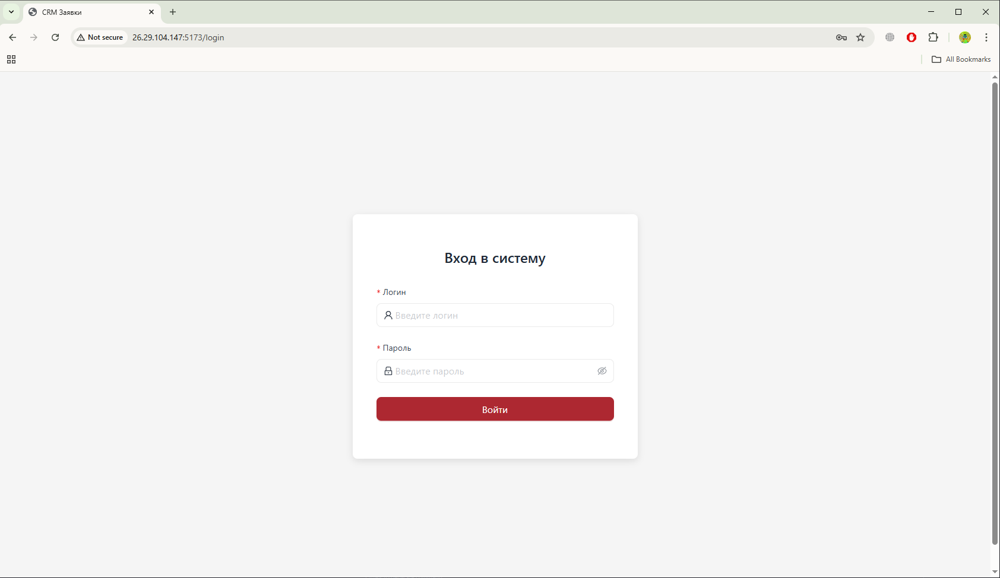
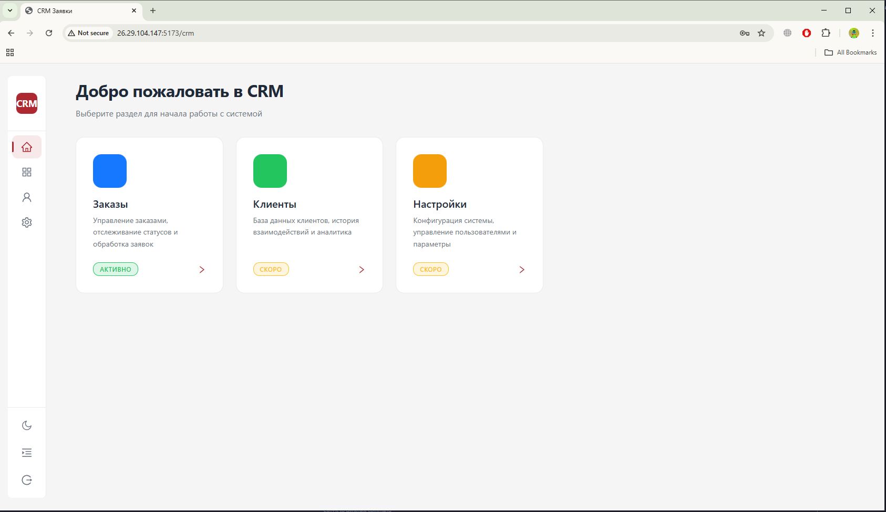
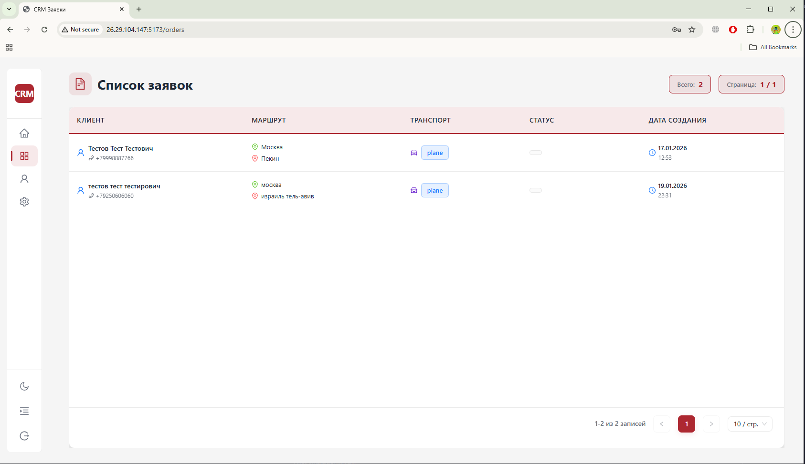
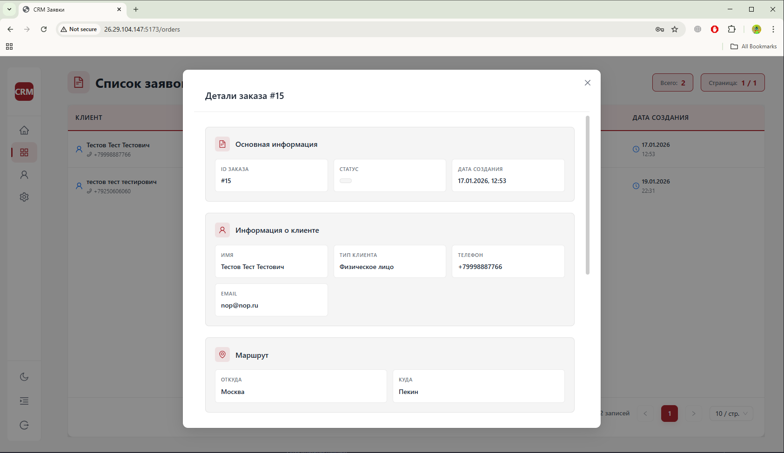

# SPA Example

## 📋 Описание

Одностраничное приложение (SPA) для управления заявками.

## 🛠 Технологический стек

### Frontend
- **React 18** - библиотека для построения пользовательского интерфейса
- **TypeScript** - типизированный JavaScript для надежности кода
- **Vite** - современный сборщик для быстрой разработки
- **React Router DOM 6** - маршрутизация в приложении
- **Styled Components** - CSS-in-JS для стилизации компонентов
- **Ant Design** - библиотека UI компонентов
- **React Query (TanStack Query)** - управление состоянием серверных данных
- **Axios** - HTTP клиент для API запросов

### Инфраструктура
- **Docker** - контейнеризация приложения
- **Docker Compose** - оркестрация контейнеров

### Инструменты разработки
- **ESLint** - линтер для проверки кода
- **Prettier** - форматирование кода
- **TypeScript ESLint** - проверка TypeScript кода

## 📄 Страницы приложения

### 1. Страница авторизации (`/login`)
Форма входа в систему с валидацией полей. Пользователь должен ввести логин и пароль для доступа к защищенным разделам приложения.



### 2. Главная страница / CRM (`/crm`)
Защищенный раздел с административной панелью и основной функциональностью CRM системы.



### 3. Страница заявок (`/orders`)
Страница с таблицей заявок, поддерживающая:
- Пагинацию
- Детальный просмотр заявки в модальном окне
- Адаптивный дизайн для мобильных устройств




### 4. Страница 404
Страница отображается при обращении к несуществующим маршрутам.

## 🚀 Развертывание с Docker

### Требования
- Docker
- Docker Compose

### Быстрый старт

1. **Клонируйте репозиторий:**
```bash
git clone <repository-url>
cd spa-example
```

2. **Соберите и запустите контейнер:**
```bash
docker-compose up --build
```

3. **Приложение будет доступно по адресу:**
```
http://localhost:8080
```

### Команды Docker

- **Сборка образа:**
```bash
docker-compose build
```

- **Запуск контейнера:**
```bash
docker-compose up
```

- **Запуск в фоновом режиме:**
```bash
docker-compose up -d
```

- **Остановка контейнера:**
```bash
docker-compose down
```

- **Просмотр логов:**
```bash
docker-compose logs -f
```

## 💻 Локальная разработка

### Установка зависимостей
```bash
npm install
```

### Настройка переменных окружения

Для локальной разработки создайте файл `.env` в корне проекта. Приложение использует следующие переменные окружения:

```bash
VITE_API_BASE_URL=https://gocrm.gruzoperevozki-rf.com
```

### Запуск dev сервера
```bash
npm run dev
```
Приложение будет доступно на `http://localhost:8080`

### Сборка для продакшна
```bash
npm run build
```

### Просмотр production сборки
```bash
npm run preview
```

### Линтинг и форматирование
```bash
npm run lint
npm run format
```

## 📁 Структура проекта

```
src/
├── @types/          # TypeScript типы
├── api/             # API клиенты и хуки
├── components/      # Переиспользуемые компоненты
├── contexts/        # React контексты (Theme и др.)
├── layouts/         # Компоненты макетов
├── pages/           # Страницы приложения
├── styles/          # Глобальные стили и темы
└── App.tsx          # Корневой компонент приложения
```
